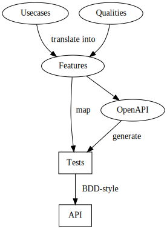

# Example API
An attempt at an reference API-implementation that comply to the following set of requirements:
- user requirements represented as usecases
- a set of quality requirements

The requirements are translated into features (gherkin) in the feature folder.

The features are mapped into an OpenAPI-specification.

Finally, most of the tests are generated from the openAPI-specifcation, while others will be handcoded based on operational features from quality-requirements. Tests are found in the app/test-folder.

The app folder contains an example implementation of an API that should pass all of the tests.

The following diagram illustrates this loosely:

